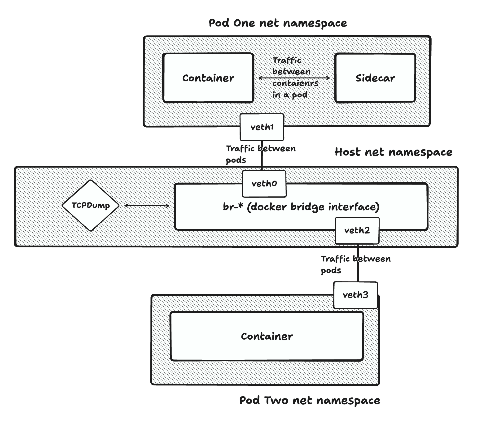

# Sniffing Docker/Pod network traffic



## Setup

To follow these instructions you need to run this on linux or windows WSL.

1. Run `docker compose up`

- This will spawn 3 containers in a new docker network.
- This docker network is a bridge network so its basically like a virtual switch
- Compose is structured in a way that it simulates pods. So two containers share network namespace while third has a separate network namespace.
  This can also be seen from URL configuration because containers inside first pod can communicate using localhost (same as sidecar - container does)

To prove this setup we can use (last ls needs sudo):

`ps -eo pid,cmd | grep -w 'main' | grep -v grep | awk '{print $1}' | xargs -I{} ls -l /proc/{}/ns/net`

Which should output:

```bash
lrwxrwxrwx 1 root root 0 Jul 29 21:36 /proc/35347/ns/net -> 'net:[4026533088]'
lrwxrwxrwx 1 root root 0 Jul 29 21:36 /proc/35354/ns/net -> 'net:[4026533304]'
lrwxrwxrwx 1 root root 0 Jul 29 21:37 /proc/35550/ns/net -> 'net:[4026533304]'
```

Which means that `35354` and `35550` share network namespace (simulates pod).

**Network namespaces** (geekish bonus):

If a process is a different network namespace it means that is has a completly new network stack (iptables, routes, ...). By default its not even reachable from host,
nor it can communicate outside network namespace (host/world). Its like a brand new machine.
What docker does is once contaienr is created (and so is network namespace), it creates a pair of virtual ethernet interfaces,
plugs one into docker bridge and other to newly created network namespace. Then it sets up ip routes for default traffic inside container through bridge and sets up IP masquerading using IP tables (when we use port publishing it also uses iptables to do the magic). Container to container communication works out of the box through bridge because of Address Resolution Protocol.

2. As I said above it uses bridge network to communicate between "pods" and to communicate to host through gateway. Because of this we can inspect traffic between
   `pod_one_container` and `pod_two_container` (when we are directly on host machine) but not traffic between `pod_one_container` and `pod_one_side_car`.

## Inspecting traffic:

1. Find the bridge network that was created by docker compose.

```bash
┌──(root㉿kali)-[/home/ales/personal/docker-networking]
└─# docker network ls
NETWORK ID     NAME                        DRIVER    SCOPE
a37f2c21c9ba   bridge                      bridge    local
b52ba1fca3c3   docker-networking_default   bridge    local
dad376595944   host                        host      local
5ba270775b0e   none                        null      local
```

In this case we are interested in `docker-networking_default`.

Then inspect it to finds its subnet:

```bash
┌──(root㉿kali)-[/home/ales/personal/docker-networking]
└─# docker network inspect docker-networking_default
[
    {
        "Name": "docker-networking_default",
        "Id": "b52ba1fca3c3b03a60c2da52c24d04eea28bb9dac127afcace360edb61f5c548",
        "Created": "2024-07-29T21:36:51.692123129+02:00",
        "Scope": "local",
        "Driver": "bridge",
        "EnableIPv6": false,
        "IPAM": {
            "Driver": "default",
            "Options": null,
            "Config": [
                {
                    "Subnet": "172.23.0.0/16",
                    "Gateway": "172.23.0.1"
                }
            ]
        },
        "Internal": false,
        "Attachable": false,
        "Ingress": false,
        "ConfigFrom": {
            "Network": ""
        },
        "ConfigOnly": false,
        "Containers": {
            "0abb58a1e38d7c5b09efe89216ede47379c608ac8e74e409721c3a29a80df41c": {
                "Name": "pod_two_container",
                "EndpointID": "df4d49203aeb70377dadeb489b5a0bf67dd58827551e06d8c020ebc312539688",
                "MacAddress": "02:42:ac:17:00:03",
                "IPv4Address": "172.23.0.3/16",
                "IPv6Address": ""
            },
            "f848dec74d15e259357011a85959031e090e1ec037990d614f31e47e25f9044e": {
                "Name": "pod_one_container",
                "EndpointID": "c382bcf4c2b193e9d84a2a6b7f9a8ed6ce05c1c154585f3733815c1d346a9592",
                "MacAddress": "02:42:ac:17:00:02",
                "IPv4Address": "172.23.0.2/16",
                "IPv6Address": ""
            }
        },
        "Options": {},
        "Labels": {
            "com.docker.compose.network": "default",
            "com.docker.compose.project": "docker-networking",
            "com.docker.compose.version": "2.18.1"
        }
    }
]
```

We can see that its subnet is:

```
    "Subnet": "172.23.0.0/16",
```

Now use `ip a` or `ifconfig` to find the network interface which has the same subnet:

```bash
┌──(root㉿kali)-[/home/ales/personal/docker-networking]
└─# ip a
1: lo: <LOOPBACK,UP,LOWER_UP> mtu 65536 qdisc noqueue state UNKNOWN group default qlen 1000
    link/loopback 00:00:00:00:00:00 brd 00:00:00:00:00:00
    inet 127.0.0.1/8 scope host lo
       valid_lft forever preferred_lft forever
    inet6 ::1/128 scope host noprefixroute
       valid_lft forever preferred_lft forever
2: eth0: <BROADCAST,MULTICAST,UP,LOWER_UP> mtu 1500 qdisc fq_codel state UP group default qlen 1000
    link/ether 8a:b4:20:b1:e5:cb brd ff:ff:ff:ff:ff:ff
    inet 192.168.64.2/24 brd 192.168.64.255 scope global dynamic eth0
       valid_lft 83114sec preferred_lft 83114sec
    inet6 fdf8:2e7e:8a09:6e7a:88b4:20ff:feb1:e5cb/64 scope global dynamic mngtmpaddr proto kernel_ra
       valid_lft 2591985sec preferred_lft 604785sec
    inet6 fe80::88b4:20ff:feb1:e5cb/64 scope link proto kernel_ll
       valid_lft forever preferred_lft forever
3: docker0: <NO-CARRIER,BROADCAST,MULTICAST,UP> mtu 1500 qdisc noqueue state DOWN group default
    link/ether 02:42:43:30:33:82 brd ff:ff:ff:ff:ff:ff
    inet 172.17.0.1/16 brd 172.17.255.255 scope global docker0
       valid_lft forever preferred_lft forever
    inet6 fe80::42:43ff:fe30:3382/64 scope link proto kernel_ll
       valid_lft forever preferred_lft forever
43: br-b52ba1fca3c3: <BROADCAST,MULTICAST,UP,LOWER_UP> mtu 1500 qdisc noqueue state UP group default
    link/ether 02:42:f1:d4:c4:7b brd ff:ff:ff:ff:ff:ff
    inet 172.23.0.1/16 brd 172.23.255.255 scope global br-b52ba1fca3c3
       valid_lft forever preferred_lft forever
    inet6 fe80::42:f1ff:fed4:c47b/64 scope link proto kernel_ll
       valid_lft forever preferred_lft forever
49: veth0c55d5b@if48: <BROADCAST,MULTICAST,UP,LOWER_UP> mtu 1500 qdisc noqueue master br-b52ba1fca3c3 state UP group default
    link/ether 32:ba:e0:6e:54:44 brd ff:ff:ff:ff:ff:ff link-netnsid 0
    inet6 fe80::30ba:e0ff:fe6e:5444/64 scope link proto kernel_ll
       valid_lft forever preferred_lft forever
51: veth192bd3b@if50: <BROADCAST,MULTICAST,UP,LOWER_UP> mtu 1500 qdisc noqueue master br-b52ba1fca3c3 state UP group default
    link/ether 52:6c:9b:40:04:c4 brd ff:ff:ff:ff:ff:ff link-netnsid 1
    inet6 fe80::506c:9bff:fe40:4c4/64 scope link proto kernel_ll
       valid_lft forever preferred_lft forever
```

We can see that `br-b52ba1fca3c3` matches this the previously inspected subnet (we are looking for br-\* something).

2. Use `tcpdump` to inspect traffic:

```bash
┌──(root㉿kali)-[/home/ales/personal/docker-networking]
└─# tcpdump -X -i br-b52ba1fca3c3
tcpdump: verbose output suppressed, use -v[v]... for full protocol decode
listening on br-b52ba1fca3c3, link-type EN10MB (Ethernet), snapshot length 262144 bytes
21:52:15.185916 IP 172.23.0.3.50774 > 172.23.0.2.http-alt: Flags [P.], seq 886392640:886392743, ack 2247930128, win 249, options [nop,nop,TS val 3451396165 ecr 1881642586], length 103: HTTP: GET / HTTP/1.1
        0x0000:  4500 009b e90e 4000 4006 f91a ac17 0003  E.....@.@.......
        0x0010:  ac17 0002 c656 1f90 34d5 4740 85fc b110  .....V..4.G@....
        0x0020:  8018 00f9 58c1 0000 0101 080a cdb8 2045  ....X..........E
        0x0030:  7027 965a 4745 5420 2f20 4854 5450 2f31  p'.ZGET./.HTTP/1
        0x0040:  2e31 0d0a 486f 7374 3a20 706f 645f 6f6e  .1..Host:.pod_on
        0x0050:  655f 636f 6e74 6169 6e65 723a 3830 3830  e_container:8080
        0x0060:  0d0a 5573 6572 2d41 6765 6e74 3a20 476f  ..User-Agent:.Go
        0x0070:  2d68 7474 702d 636c 6965 6e74 2f31 2e31  -http-client/1.1
        0x0080:  0d0a 4163 6365 7074 2d45 6e63 6f64 696e  ..Accept-Encodin
        0x0090:  673a 2067 7a69 700d 0a0d 0a              g:.gzip....
21:52:15.186572 IP 172.23.0.2.http-alt > 172.23.0.3.50774: Flags [P.], seq 1:147, ack 103, win 249, options [nop,nop,TS val 1881647593 ecr 3451396165], length 146: HTTP: HTTP/1.1 200 OK
        0x0000:  4500 00c6 5b44 4000 4006 86ba ac17 0002  E...[D@.@.......
        0x0010:  ac17 0003 1f90 c656 85fc b110 34d5 47a7  .......V....4.G.
        0x0020:  8018 00f9 58ec 0000 0101 080a 7027 a9e9  ....X.......p'..
        0x0030:  cdb8 2045 4854 5450 2f31 2e31 2032 3030  ...EHTTP/1.1.200
        0x0040:  204f 4b0d 0a44 6174 653a 204d 6f6e 2c20  .OK..Date:.Mon,.
        0x0050:  3239 204a 756c 2032 3032 3420 3139 3a35  29.Jul.2024.19:5
        0x0060:  323a 3135 2047 4d54 0d0a 436f 6e74 656e  2:15.GMT..Conten
        0x0070:  742d 4c65 6e67 7468 3a20 3239 0d0a 436f  t-Length:.29..Co
        0x0080:  6e74 656e 742d 5479 7065 3a20 7465 7874  ntent-Type:.text
        0x0090:  2f70 6c61 696e 3b20 6368 6172 7365 743d  /plain;.charset=
        0x00a0:  7574 662d 380d 0a0d 0a48 656c 6c6f 2066  utf-8....Hello.f
        0x00b0:  726f 6d20 706f 645f 6f6e 655f 636f 6e74  rom.pod_one_cont
        0x00c0:  6169 6e65 7221                           ainer!
```

We can see that there is only traffic between `pod_one_container` and `pod_two_container`.

### Inspect traffic between containers inside pod

To inspect traffic between pod's containers we need to enter the pod's namespace (which requires root privileges).

1. Find the PID of one of the containers inside the first pod.

```bash
┌──(root㉿kali)-[/home/ales/personal/docker-networking]
└─# ps -eo pid,cmd | grep -w 'main' | grep -v grep | awk '{print $1}' | xargs -I{} ls -l /proc/{}/ns/net
lrwxrwxrwx 1 root root 0 Jul 29 21:48 /proc/42621/ns/net -> 'net:[4026533088]'
lrwxrwxrwx 1 root root 0 Jul 29 21:48 /proc/42628/ns/net -> 'net:[4026533304]'
lrwxrwxrwx 1 root root 0 Jul 29 21:56 /proc/42777/ns/net -> 'net:[4026533088]'
```

From the above output we can assume that we should further investigate PIDs `42777` and `42621` since they share the same net namespace ID.

2. Enter the net namespace of PID 42777

`nsenter -t 42777 -a /bin/bash`

- -t means which PID to target
- -a means to join all namespaces (we could just target net ns)

3. Inpect traffic. Since we know that communication is happening through localhost we are interested in the loopback interface.

```bash
┌──(root㉿kali)-[/home/ales/personal/docker-networking]
└─# nsenter -t 42777 -a /bin/bash
root@f848dec74d15:/# ifconfig
eth0: flags=4163<UP,BROADCAST,RUNNING,MULTICAST>  mtu 1500
        inet 172.23.0.2  netmask 255.255.0.0  broadcast 172.23.255.255
        ether 02:42:ac:17:00:02  txqueuelen 0  (Ethernet)
        RX packets 261  bytes 29917 (29.2 KiB)
        RX errors 0  dropped 0  overruns 0  frame 0
        TX packets 125  bytes 25888 (25.2 KiB)
        TX errors 0  dropped 0 overruns 0  carrier 0  collisions 0

lo: flags=73<UP,LOOPBACK,RUNNING>  mtu 65536
        inet 127.0.0.1  netmask 255.0.0.0
        loop  txqueuelen 1000  (Local Loopback)
        RX packets 739  bytes 96898 (94.6 KiB)
        RX errors 0  dropped 0  overruns 0  frame 0
        TX packets 739  bytes 96898 (94.6 KiB)
        TX errors 0  dropped 0 overruns 0  carrier 0  collisions 0

root@f848dec74d15:/# tcpdump -X -i lo
tcpdump: verbose output suppressed, use -v[v]... for full protocol decode
listening on lo, link-type EN10MB (Ethernet), snapshot length 262144 bytes
19:58:50.745827 IP localhost.44262 > localhost.8888: Flags [P.], seq 943152504:943152599, ack 3600780165, win 260, options [nop,nop,TS val 1608357247 ecr 1608352245], length 95
        0x0000:  4500 0093 c7a2 4000 4006 74c0 7f00 0001  E.....@.@.t.....
        0x0010:  7f00 0001 ace6 22b8 3837 5d78 d69f 8b85  ......".87]x....
        0x0020:  8018 0104 fe87 0000 0101 080a 5fdd 957f  ............_...
        0x0030:  5fdd 81f5 4745 5420 2f20 4854 5450 2f31  _...GET./.HTTP/1
        0x0040:  2e31 0d0a 486f 7374 3a20 6c6f 6361 6c68  .1..Host:.localh
        0x0050:  6f73 743a 3838 3838 0d0a 5573 6572 2d41  ost:8888..User-A
        0x0060:  6765 6e74 3a20 476f 2d68 7474 702d 636c  gent:.Go-http-cl
        0x0070:  6965 6e74 2f31 2e31 0d0a 4163 6365 7074  ient/1.1..Accept
        0x0080:  2d45 6e63 6f64 696e 673a 2067 7a69 700d  -Encoding:.gzip.
        0x0090:  0a0d 0a                                  ...
19:58:50.746366 IP localhost.8888 > localhost.44262: Flags [P.], seq 1:146, ack 95, win 260, options [nop,nop,TS val 1608357248 ecr 1608357247], length 145
        0x0000:  4500 00c5 f1fb 4000 4006 4a35 7f00 0001  E.....@.@.J5....
        0x0010:  7f00 0001 22b8 ace6 d69f 8b85 3837 5dd7  ....".......87].
        0x0020:  8018 0104 feb9 0000 0101 080a 5fdd 9580  ............_...
        0x0030:  5fdd 957f 4854 5450 2f31 2e31 2032 3030  _...HTTP/1.1.200
        0x0040:  204f 4b0d 0a44 6174 653a 204d 6f6e 2c20  .OK..Date:.Mon,.
        0x0050:  3239 204a 756c 2032 3032 3420 3139 3a35  29.Jul.2024.19:5
        0x0060:  383a 3530 2047 4d54 0d0a 436f 6e74 656e  8:50.GMT..Conten
        0x0070:  742d 4c65 6e67 7468 3a20 3238 0d0a 436f  t-Length:.28..Co
        0x0080:  6e74 656e 742d 5479 7065 3a20 7465 7874  ntent-Type:.text
        0x0090:  2f70 6c61 696e 3b20 6368 6172 7365 743d  /plain;.charset=
        0x00a0:  7574 662d 380d 0a0d 0a48 656c 6c6f 2066  utf-8....Hello.f
        0x00b0:  726f 6d20 706f 645f 6f6e 655f 7369 6465  rom.pod_one_side
        0x00c0:  5f63 6172 21                             _car!
19:58:50.746414 IP localhost.44262 > localhost.8888: Flags [.], ack 146, win 259, options [nop,nop,TS val 1608357248 ecr 1608357248], length 0
        0x0000:  4500 0034 c7a3 4000 4006 751e 7f00 0001  E..4..@.@.u.....
        0x0010:  7f00 0001 ace6 22b8 3837 5dd7 d69f 8c16  ......".87].....
        0x0020:  8010 0103 fe28 0000 0101 080a 5fdd 9580  .....(......_...
        0x0030:  5fdd 9580                                _...
19:58:50.746448 IP localhost.59458 > localhost.http-alt: Flags [P.], seq 4213948089:4213948184, ack 3368923405, win 260, options [nop,nop,TS val 1608357248 ecr 1608352244], length 95: HTTP: GET / HTTP/1.1
        0x0000:  4500 0093 d3c4 4000 4006 689e 7f00 0001  E.....@.@.h.....
        0x0010:  7f00 0001 e842 1f90 fb2b beb9 c8cd b10d  .....B...+......
        0x0020:  8018 0104 fe87 0000 0101 080a 5fdd 9580  ............_...
        0x0030:  5fdd 81f4 4745 5420 2f20 4854 5450 2f31  _...GET./.HTTP/1
        0x0040:  2e31 0d0a 486f 7374 3a20 6c6f 6361 6c68  .1..Host:.localh
        0x0050:  6f73 743a 3830 3830 0d0a 5573 6572 2d41  ost:8080..User-A
        0x0060:  6765 6e74 3a20 476f 2d68 7474 702d 636c  gent:.Go-http-cl
        0x0070:  6965 6e74 2f31 2e31 0d0a 4163 6365 7074  ient/1.1..Accept
        0x0080:  2d45 6e63 6f64 696e 673a 2067 7a69 700d  -Encoding:.gzip.
        0x0090:  0a0d 0a                                  ...
19:58:50.746797 IP localhost.http-alt > localhost.59458: Flags [P.], seq 1:147, ack 95, win 260, options [nop,nop,TS val 1608357248 ecr 1608357248], length 146: HTTP: HTTP/1.1 200 OK
        0x0000:  4500 00c6 fafd 4000 4006 4132 7f00 0001  E.....@.@.A2....
        0x0010:  7f00 0001 1f90 e842 c8cd b10d fb2b bf18  .......B.....+..
        0x0020:  8018 0104 feba 0000 0101 080a 5fdd 9580  ............_...
        0x0030:  5fdd 9580 4854 5450 2f31 2e31 2032 3030  _...HTTP/1.1.200
        0x0040:  204f 4b0d 0a44 6174 653a 204d 6f6e 2c20  .OK..Date:.Mon,.
        0x0050:  3239 204a 756c 2032 3032 3420 3139 3a35  29.Jul.2024.19:5
        0x0060:  383a 3530 2047 4d54 0d0a 436f 6e74 656e  8:50.GMT..Conten
        0x0070:  742d 4c65 6e67 7468 3a20 3239 0d0a 436f  t-Length:.29..Co
        0x0080:  6e74 656e 742d 5479 7065 3a20 7465 7874  ntent-Type:.text
        0x0090:  2f70 6c61 696e 3b20 6368 6172 7365 743d  /plain;.charset=
        0x00a0:  7574 662d 380d 0a0d 0a48 656c 6c6f 2066  utf-8....Hello.f
        0x00b0:  726f 6d20 706f 645f 6f6e 655f 636f 6e74  rom.pod_one_cont
        0x00c0:  6169 6e65 7221                           ainer!
19:58:50.746833 IP localhost.59458 > localhost.http-alt: Flags [.], ack 147, win 259, options [nop,nop,TS val 1608357248 ecr 1608357248], length 0
        0x0000:  4500 0034 d3c5 4000 4006 68fc 7f00 0001  E..4..@.@.h.....
        0x0010:  7f00 0001 e842 1f90 fb2b bf18 c8cd b19f  .....B...+......
        0x0020:  8010 0103 fe28 0000 0101 080a 5fdd 9580  .....(......_...
        0x0030:  5fdd 9580                                _...
```

## Note

These were handmade "pods", k8s is flexible with its network setup/implementation, so different CNI might result in different implementations.
